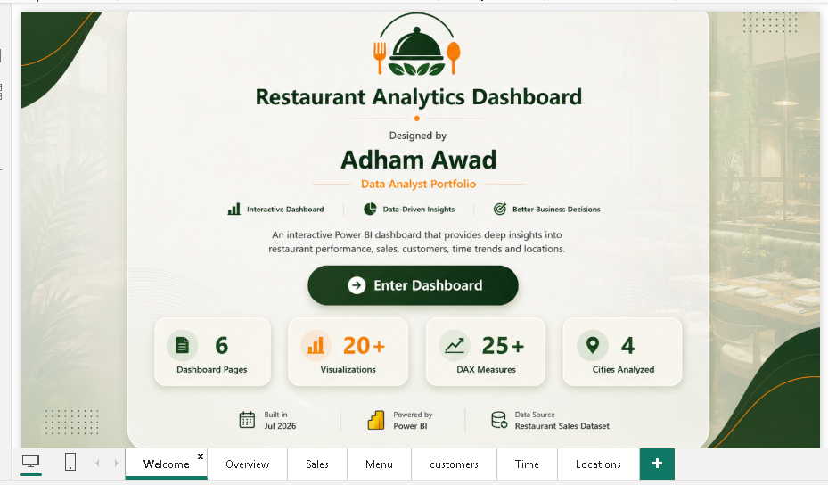
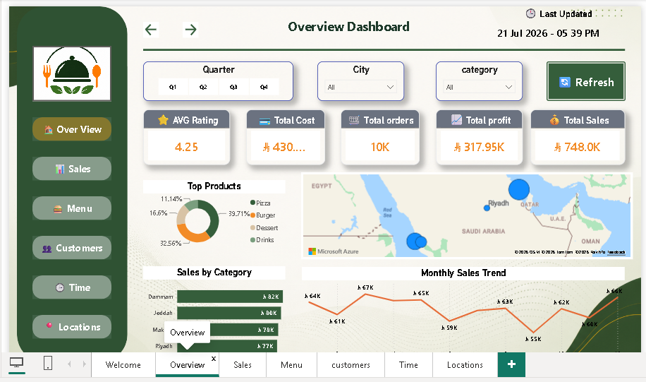
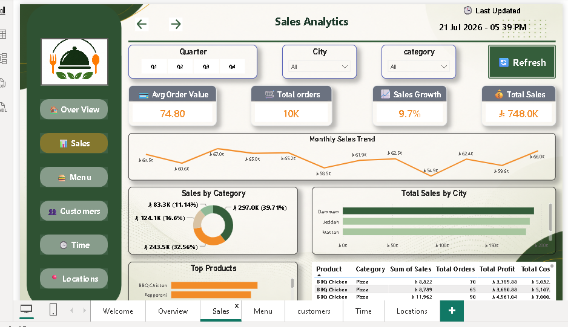
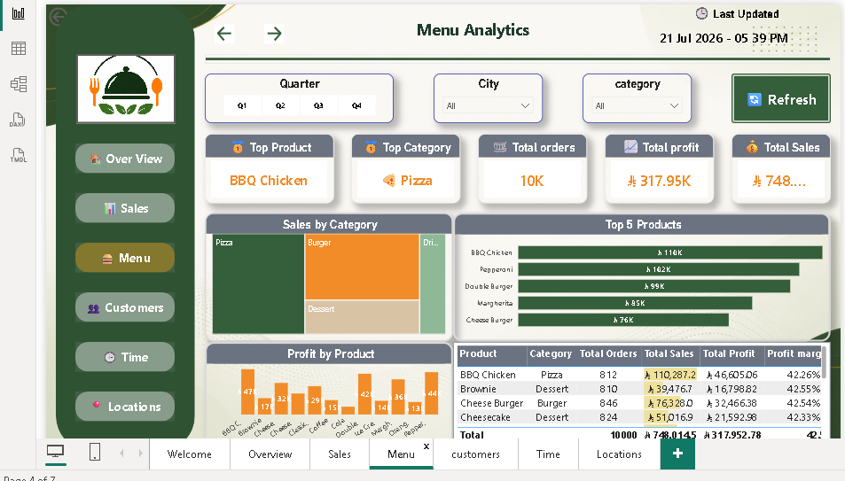
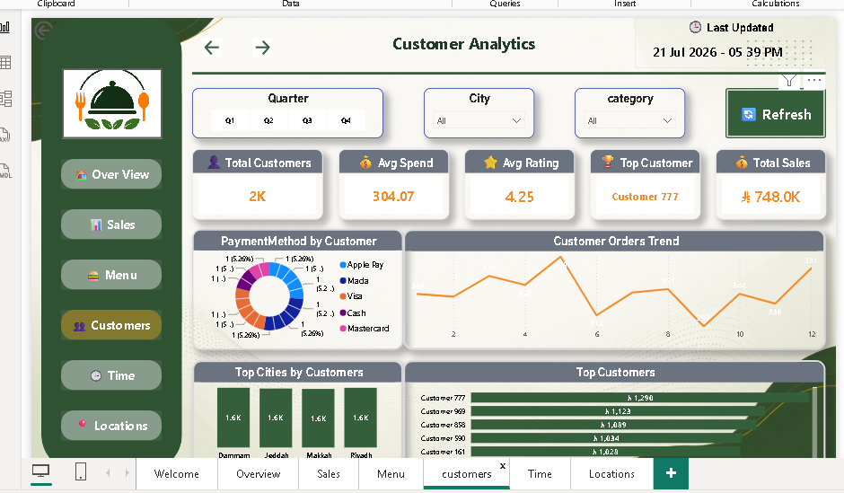
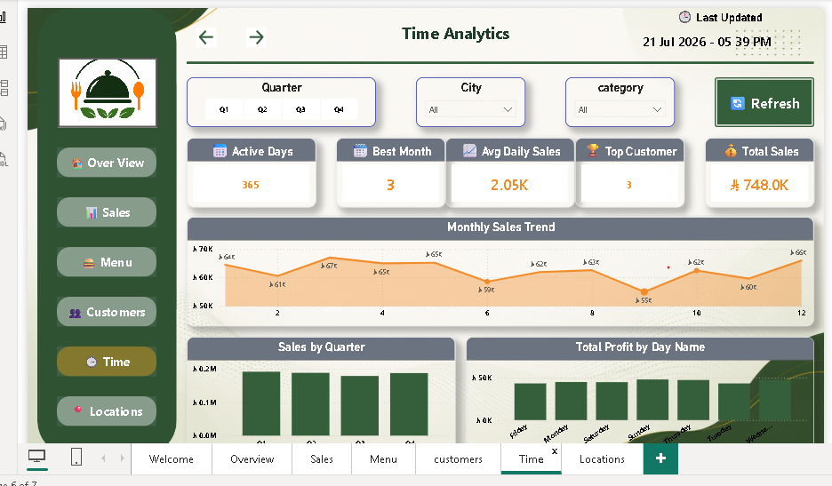
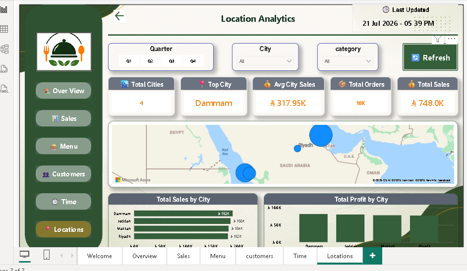

# 🍽️ Restaurant Analytics Dashboard

## 📌 Project Overview

This project is an interactive Restaurant Analytics Dashboard developed using **Power BI** to help restaurant managers monitor sales performance, customer behavior, menu performance, time trends, and location insights.

---

## 🚀 Dashboard Pages

- 🏠 Welcome
- 📊 Overview
- 💰 Sales Analysis
- 🍔 Menu Analysis
- 👥 Customer Analysis
- 🕒 Time Analysis
- 📍 Location Analysis

---

## 📈 Key Features

- Interactive Navigation
- Dynamic KPIs
- Sales Performance Analysis
- Customer Insights
- Time Intelligence
- Location Analytics
- Responsive Dashboard Design
- Professional UI/UX

---

## 🛠️ Tools Used

- Power BI
- Power Query
- DAX
- Microsoft Excel

---

## 📊 KPIs

- Total Sales
- Total Profit
- Total Orders
- Average Rating
- Customers

---

## 📷 Dashboard Preview

### Welcome

### Overview

### Sales

### Menu

### Customers

### Time

### Locations

---

## 👨‍💻 Author

**Adham Awad**

Data Analyst | Power BI Developer

LinkedIn: https://www.linkedin.com/in/adham-mahmoud-a680032a9/

GitHub:
